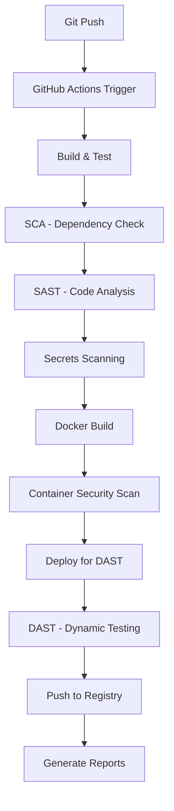

# Projekt DevSecOps - PyGoat Pipeline

## Wprowadzenie

Projekt implementuje kompletny pipeline DevSecOps dla podatnej aplikacji PyGoat, integrując różne narzędzia bezpieczeństwa w proces CI/CD.

## Architektura Pipeline'u



## Struktura Projektu

```
pygoat-devsecops/
├── .github/
│   └── workflows/
│       └── devsecops.yml
├── docker/
│   ├── Dockerfile
│   └── docker-compose.yml
├── security/
│   ├── bandit.yml
│   ├── semgrep.yml
│   └── trivy.yml
├── scripts/
│   ├── setup.sh
│   ├── dast-test.sh
│   └── generate-report.py
├── pygoat/ (kod aplikacji)
├── requirements.txt
└── README.md
```

## Implementacja Pipeline'u

### 1. Dockerfile

```dockerfile
FROM python:3.9-slim

# Bezpieczniejszy base image
LABEL maintainer="devsecops-team"
LABEL version="1.0"

# Tworzenie użytkownika bez uprawnień root
RUN groupadd -r pygoat && useradd -r -g pygoat pygoat

# Instalacja zależności systemowych
RUN apt-get update && apt-get install -y \
    gcc \
    && rm -rf /var/lib/apt/lists/*

# Ustawienie katalogu roboczego
WORKDIR /app

# Kopiowanie i instalacja zależności Python
COPY requirements.txt .
RUN pip install --no-cache-dir -r requirements.txt

# Kopiowanie kodu aplikacji
COPY . .

# Ustawienie właściciela plików
RUN chown -R pygoat:pygoat /app

# Przełączenie na użytkownika bez uprawnień root
USER pygoat

# Expose port
EXPOSE 8000

# Uruchomienie aplikacji
CMD ["python", "manage.py", "runserver", "0.0.0.0:8000"]
```

### 2. GitHub Actions Workflow

```yaml
name: DevSecOps Pipeline

on:
  push:
    branches: [ main, develop ]
  pull_request:
    branches: [ main ]

env:
  REGISTRY: docker.io
  IMAGE_NAME: ${{ github.repository_owner }}/pygoat
  PYTHON_VERSION: '3.9'

jobs:
  security-analysis:
    runs-on: ubuntu-latest
    
    steps:
    - name: Checkout code
      uses: actions/checkout@v4
      with:
        fetch-depth: 0

    - name: Set up Python
      uses: actions/setup-python@v4
      with:
        python-version: ${{ env.PYTHON_VERSION }}

    # SCA - Software Composition Analysis
    - name: Install dependencies
      run: |
        python -m pip install --upgrade pip
        pip install -r requirements.txt
        pip install safety bandit semgrep

    - name: SCA - Safety Check
      run: |
        safety check --json --output safety-report.json || true
        safety check --short-report || true

    - name: SCA - Pip Audit
      run: |
        pip install pip-audit
        pip-audit --format=json --output=pip-audit-report.json || true
        pip-audit --desc || true

    # Secrets Scanning
    - name: Secrets Scan - GitLeaks
      uses: gitleaks/gitleaks-action@v2
      env:
        GITHUB_TOKEN: ${{ secrets.GITHUB_TOKEN }}
        GITLEAKS_LICENSE: ${{ secrets.GITLEAKS_LICENSE }}

    - name: Secrets Scan - TruffleHog
      uses: trufflesecurity/trufflehog@main
      with:
        path: ./
        base: main
        head: HEAD
        extra_args: --debug --only-verified

    # SAST - Static Application Security Testing
    - name: SAST - Bandit
      run: |
        bandit -r . -f json -o bandit-report.json || true
        bandit -r . -f txt || true

    - name: SAST - Semgrep
      uses: returntocorp/semgrep-action@v1
      with:
        config: >-
          p/security-audit
          p/secrets
          p/owasp-top-ten
          p/django
        generateSarif: "1"

    # Build Docker Image
    - name: Set up Docker Buildx
      uses: docker/setup-buildx-action@v3

    - name: Build Docker image
      uses: docker/build-push-action@v5
      with:
        context: .
        push: false
        tags: ${{ env.IMAGE_NAME }}:${{ github.sha }}
        cache-from: type=gha
        cache-to: type=gha,mode=max

    # Container Security Scanning
    - name: Container Scan - Trivy
      uses: aquasecurity/trivy-action@master
      with:
        image-ref: '${{ env.IMAGE_NAME }}:${{ github.sha }}'
        format: 'sarif'
        output: 'trivy-results.sarif'

    - name: Container Scan - Trivy (Table)
      uses: aquasecurity/trivy-action@master
      with:
        image-ref: '${{ env.IMAGE_NAME }}:${{ github.sha }}'
        format: 'table'
        severity: 'HIGH,CRITICAL'

  dast-testing:
    runs-on: ubuntu-latest
    needs: security-analysis
    
    services:
      docker:
        image: docker:dind
        options: --privileged
    
    steps:
    - name: Checkout code
      uses: actions/checkout@v4

    - name: Set up Docker Buildx
      uses: docker/setup-buildx-action@v3

    - name: Build test image
      run: |
        docker build -t pygoat-test:latest .

    # DAST - Dynamic Application Security Testing
    - name: Start application for DAST
      run: |
        docker run -d -p 8000:8000 --name pygoat-test pygoat-test:latest
        sleep 30
        curl -f http://localhost:8000 || exit 1

    - name: DAST - OWASP ZAP Baseline Scan
      uses: zaproxy/action-baseline@v0.10.0
      with:
        target: 'http://localhost:8000'
        rules_file_name: '.zap/rules.tsv'

    - name: DAST - OWASP ZAP Full Scan
      uses: zaproxy/action-full-scan@v0.8.0
      with:
        target: 'http://localhost:8000'
        rules_file_name: '.zap/rules.tsv'

    - name: Stop test container
      run: docker stop pygoat-test

  deploy:
    runs-on: ubuntu-latest
    needs: [security-analysis, dast-testing]
    if: github.ref == 'refs/heads/main'
    
    steps:
    - name: Checkout code
      uses: actions/checkout@v4

    - name: Set up Docker Buildx
      uses: docker/setup-buildx-action@v3

    - name: Log in to Docker Hub
      uses: docker/login-action@v3
      with:
        username: ${{ secrets.DOCKER_USERNAME }}
        password: ${{ secrets.DOCKER_PASSWORD }}

    - name: Build and push Docker image
      uses: docker/build-push-action@v5
      with:
        context: .
        push: true
        tags: |
          ${{ env.IMAGE_NAME }}:latest
          ${{ env.IMAGE_NAME }}:${{ github.sha }}
        cache-from: type=gha
        cache-to: type=gha,mode=max

    - name: Generate Security Report
      run: |
        echo "# Security Scan Results" > security-report.md
        echo "## Build: ${{ github.sha }}" >> security-report.md
        echo "## Date: $(date)" >> security-report.md
        
        if [ -f safety-report.json ]; then
          echo "## SCA Results" >> security-report.md
          python -c "
          import json
          with open('safety-report.json') as f:
              data = json.load(f)
              print(f'Found {len(data)} vulnerabilities')
          " >> security-report.md
        fi

    - name: Upload Security Reports
      uses: actions/upload-artifact@v3
      with:
        name: security-reports
        path: |
          *-report.json
          *.sarif
          security-report.md
```

### 3. Konfiguracja Bandit (.bandit)

```yaml
tests: [B101, B102, B103, B104, B105, B106, B107, B108, B110, B112, B201, B301, B302, B303, B304, B305, B306, B307, B308, B309, B310, B311, B312, B313, B314, B315, B316, B317, B318, B319, B320, B321, B322, B323, B324, B325, B401, B402, B403, B404, B405, B406, B407, B408, B409, B410, B411, B412, B413, B501, B502, B503, B504, B505, B506, B507, B601, B602, B603, B604, B605, B606, B607, B608, B609, B610, B611, B701, B702, B703]
skips: [B110, B410]
```

### 4. ZAP Rules (.zap/rules.tsv)

```
10021	IGNORE	(Cookie No HttpOnly Flag)
10023	IGNORE	(Information Disclosure)
10025	IGNORE	(Information Disclosure - Debug Error Messages)
10026	IGNORE	(HTTP Parameter Override)
10027	IGNORE	(Information Disclosure - Suspicious Comments)
```

### 5. Script do generowania raportów (scripts/generate-report.py)

```python
#!/usr/bin/env python3

import json
import os
import sys
from datetime import datetime

def load_json_report(filename):
    """Load JSON report if exists"""
    if os.path.exists(filename):
        with open(filename, 'r') as f:
            return json.load(f)
    return None

def generate_security_report():
    """Generate comprehensive security report"""
    
    report = {
        "timestamp": datetime.now().isoformat(),
        "summary": {
            "total_vulnerabilities": 0,
            "high_critical": 0,
            "medium": 0,
            "low": 0
        },
        "scans": {}
    }
    
    # Safety check results
    safety_data = load_json_report('safety-report.json')
    if safety_data:
        report["scans"]["sca_safety"] = {
            "vulnerabilities": len(safety_data),
            "details": safety_data
        }
        report["summary"]["total_vulnerabilities"] += len(safety_data)
    
    # Bandit results
    bandit_data = load_json_report('bandit-report.json')
    if bandit_data:
        high_critical = len([x for x in bandit_data.get('results', []) 
                           if x.get('issue_severity') in ['HIGH', 'CRITICAL']])
        report["scans"]["sast_bandit"] = {
            "total_issues": len(bandit_data.get('results', [])),
            "high_critical": high_critical,
            "details": bandit_data
        }
        report["summary"]["high_critical"] += high_critical
    
    # Generate markdown report
    with open('security-summary.md', 'w') as f:
        f.write(f"# Security Scan Summary\n\n")
        f.write(f"**Generated:** {report['timestamp']}\n\n")
        f.write(f"## Overview\n\n")
        f.write(f"- Total Vulnerabilities: {report['summary']['total_vulnerabilities']}\n")
        f.write(f"- High/Critical: {report['summary']['high_critical']}\n\n")
        
        for scan_type, data in report["scans"].items():
            f.write(f"### {scan_type.upper()}\n")
            f.write(f"- Issues found: {data.get('vulnerabilities', data.get('total_issues', 0))}\n")
            if 'high_critical' in data:
                f.write(f"- High/Critical: {data['high_critical']}\n")
            f.write("\n")
    
    # Save JSON report
    with open('security-report.json', 'w') as f:
        json.dump(report, f, indent=2)
    
    print(f"Security report generated: {report['summary']['total_vulnerabilities']} total vulnerabilities")
    return report['summary']['high_critical'] == 0

if __name__ == "__main__":
    success = generate_security_report()
    sys.exit(0 if success else 1)
```

## Kroki Implementacji

### 1. Przygotowanie repozytorium

```bash
# Sklonuj PyGoat
git clone https://github.com/adeyosemanputra/pygoat.git
cd pygoat

# Stwórz nową gałąź dla DevSecOps
git checkout -b devsecops-implementation

# Dodaj pliki konfiguracyjne
mkdir -p .github/workflows
mkdir -p security
mkdir -p scripts
```

### 2. Konfiguracja secrets w GitHub

Dodaj następujące secrets w GitHub repository:
- `DOCKER_USERNAME` - twoja nazwa użytkownika Docker Hub
- `DOCKER_PASSWORD` - token dostępu Docker Hub

### 3. Uruchomienie lokalnie

```bash
# Test lokalny
docker build -t pygoat-local .
docker run -p 8000:8000 pygoat-local

# Test bezpieczeństwa lokalnie
pip install bandit safety
bandit -r .
safety check
```

## Przewidywane Podatności do Naprawy

### SCA (Software Composition Analysis)
- Stare wersje Django z podatnościami CVE
- Podatne biblioteki Python (Pillow, requests, etc.)
- Dependency confusion attacks

### SAST (Static Application Security Testing)
- SQL Injection patterns
- XSS vulnerabilities w templates
- Hardcoded secrets
- Insecure random number generation

### Container Security
- Vulnerable base images
- Running as root user
- Exposed ports and services

### DAST (Dynamic Application Security Testing)
- Authentication bypasses
- Session management flaws
- Input validation issues

## Przykłady Napraw

### 1. Naprawa Dockerfile (bezpieczeństwo kontenerów)

```dockerfile
# PRZED - niebezpieczne
FROM python:3.9
USER root
COPY . /app

# PO - bezpieczne
FROM python:3.9-slim
RUN groupadd -r pygoat && useradd -r -g pygoat pygoat
COPY . /app
RUN chown -R pygoat:pygoat /app
USER pygoat
```

### 2. Naprawa requirements.txt (SCA)

```txt
# PRZED - podatne wersje
Django==3.1.0
Pillow==7.0.0

# PO - bezpieczne wersje
Django==4.2.7
Pillow==10.1.0
```

### 3. Naprawa kodu Python (SAST)

```python
# PRZED - SQL Injection
def get_user(user_id):
    query = f"SELECT * FROM users WHERE id = {user_id}"
    return execute_query(query)

# PO - bezpieczne
def get_user(user_id):
    query = "SELECT * FROM users WHERE id = %s"
    return execute_query(query, (user_id,))
```

## Monitoring i Raporty

Pipeline generuje następujące raporty:
- `security-report.json` - kompleksowy raport JSON
- `security-summary.md` - czytelny raport Markdown
- SARIF files dla integracji z GitHub Security tab
- Artefakty dla każdego narzędzia skanowania

## Kolejne Kroki

1. Implementuj wszystkie pliki konfiguracyjne
2. Uruchom pipeline i napraw znalezione podatności
3. Zoptymalizuj czas wykonania skanów
4. Dodaj notification na Slack/Teams
5. Rozważ integrację z SonarQube dla głębszej analizy kodu

Ten projekt demonstruje pełną implementację DevSecOps z automatyzacją bezpieczeństwa w każdym etapie development lifecycle.